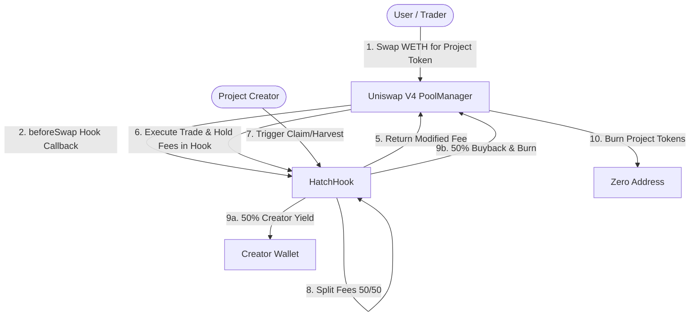

# HatchAI — Uniswap V4 Hook-Protected Safe Launchpad

HatchAI is a next-generation token launchpad and swap terminal built on **X Layer Testnet** (Chain ID: `1952`), powered by customized **Uniswap V4 Hooks**. 

By leveraging the flexible callback architecture of Uniswap V4, HatchAI implements automated anti-bot, anti-whale, and sustainable yield systems directly at the pool level. The application features a premium soft-minimalist sand/coral/ink visual design, complete with interactive micro-animations (like a hatching egg that splits open on hover) and live onchain transaction dashboards.

---

## 🐣 The Problem with Modern Token Launches
In the decentralized ecosystem, new token launches face severe risks:
1. **Sniper Bots**: High-speed algorithms buy up massive portions of token supply in the exact block liquidity is added, frontrunning retail community members.
2. **Whale Price Manipulation**: Large early swaps create massive price slippage and instigate panic selling.
3. **Short-Term Speculation**: Most pools lose momentum because trading fees go entirely to passive liquidity providers rather than supporting ongoing project development.

---

## 🛡️ The HatchAI Solution

HatchAI introduces the **`HatchHook`**, a smart Uniswap V4 hook contract that intercepts pool actions to enforce a secure launch window:

### 1. Dynamic Fee Decay
During the launch phase, swap fees start high (e.g., `10%`) to make bot frontrunning financially non-viable. Over a configured decay duration (e.g., 24 hours), this tax decays linearly onchain down to the project's standard baseline rate (e.g., `0.3%`).

### 2. Anti-Whale Swap Caps
Restricts individual transaction sizes to a custom percentage of total pool supply during the launch phase, ensuring a decentralized and fair token distribution.

### 3. Wallet Cooldown Timers
Enforces a block-level delay between consecutive trades from the same wallet address, neutralizing high-frequency arbitrage algorithms.

### 4. The Deflationary Yield Loop
Instead of fees disappearing into passive LP positions, the hook contract holds and harvests collected base tokens (WETH). Upon claim, fees are automatically split onchain:
*   **50% Creator Yield**: Sent directly to the project creator to sustainably fund ongoing development.
*   **50% Buyback & Burn**: Used to automatically buy back project tokens from the Uniswap pool and burn them instantly, applying constant buying pressure and reducing the token supply.

---

## 🧬 HatchAI & Launchpads (e.g., Flap.sh): A Complementary Evolution

HatchAI is designed to run alongside and supercharge existing token launchpads like **Flap.sh** on **X Layer** and **Uniswap V4**. 

Rather than competing with traditional bonding curve models, HatchAI acts as an **advanced liquidity infrastructure extension** that solves a critical post-launch phase problem: **Post-Migration Security & Sustainable Yield**.

### 1. The Post-Migration Security Shield for Flap.sh
When tokens launched on **Flap.sh** reach their bonding curve target, their liquidity is migrated to a standard DEX pool on Uniswap. At this exact moment of handoff, all bonding-curve level protections (such as whale limits or price stability mechanisms) disappear, exposing the brand new pool to sniper bots and instant whale manipulation.

* **How HatchAI integrates:** Instead of migrating Flap.sh tokens into a vanilla Uniswap pool, they can be deployed directly into a **HatchHook-protected Uniswap V4 pool**. 
* **The Result:** The newly migrated token retains institutional-grade swap caps, decaying launch taxes, wallet cooldowns, and automated yield harvesting natively inside the Uniswap V4 pool, ensuring a safe transition onto the public DEX.

### 2. Direct-to-DEX Alternative via V4 Native Hooks
For projects that prefer to bypass the bonding curve phase entirely, HatchAI provides a direct route by initiating trading in a Uniswap V4 pool from block one. 

* **No Migration Bottlenecks:** The hook coordinates all initial whale protections, dynamic fee decays, and deflationary buyback-burns directly inside the pool. 
* **Seamless Maturity:** Once the custom launch window passes, the fees dynamically decay and limits disable onchain. The pool transitions into a standard trading pool without moving a single wei of liquidity, eliminating expensive gas and transaction failure risks.

---

## ⚙️ Architecture Workflow



---

## 🛠️ Smart Contracts & Deployment Info

HatchAI is deployed and active on **X Layer Testnet**:

*   **PoolManager**: [`0xe5392F2AF7f2DA3C386cB879C35ABfa2DAcdaE4D`](https://www.oklink.com/xlayer-test/address/0xe5392F2AF7f2DA3C386cB879C35ABfa2DAcdaE4D)
*   **HatchHook**: [`0xe78117Bf2Ca342ce1DcBa2367d3CCAb30bb3508f`](https://www.oklink.com/xlayer-test/address/0xe78117Bf2Ca342ce1DcBa2367d3CCAb30bb3508f)
*   **Mock WETH Contract**: [`0x7dFA2F6198fA01c2105e197475d40A34032483d7`](https://www.oklink.com/xlayer-test/address/0x7dFA2F6198fA01c2105e197475d40A34032483d7)
*   **Mock HATCH Token**: [`0x27C17772739E0A241C7b57F3229b47D6882E47FA`](https://www.oklink.com/xlayer-test/address/0x27C17772739E0A241C7b57F3229b47D6882E47FA)

*Note: Smart contracts are compiled and deployed using Hardhat with optimizer settings enabled.*

---

## 💻 Tech Stack & Design System

*   **Smart Contracts**: Solidity, Hardhat, Ethers.js, Uniswap V4 Core
*   **Frontend**: React, Vite, Ethers.js (Direct providers for MetaMask and OKX Wallet)
*   **Design Aesthetics**: Minimalist Sand theme (`#F0ECE4`), Coral accent (`#D2825A`), and Slate-Ink text (`#32343A`) with a fine-grain turbulence background overlay.
*   **Typography**: `Work Sans` for structure, `Instrument Serif` (Italic) for headings, and `Geist Mono` for logs and numbers.

---

## 🚀 Local Development Setup

To run HatchAI locally:

### 1. Clone the repository and install dependencies
```bash
git clone https://github.com/your-username/HatchAI.git
cd HatchAI
npm install
```

### 2. Configure Environment Variables
Create a `.env` file in the root directory:
```env
PRIVATE_KEY=your_private_key_here
XLAYER_TESTNET_RPC=https://testrpc.xlayer.tech
```

### 3. Deploy Contracts (Optional)
If you wish to redeploy the contracts on X Layer Testnet:
```bash
npx hardhat run scripts/deploy.js --network xlayer_testnet
```

### 4. Launch the Frontend Dev Server
```bash
cd frontend
npm install
npm run dev
```
Open [http://localhost:5173/](http://localhost:5173/) to view the app console.

---

## 🧪 Test Guide for Hackathon Judges

Judges can explore the full lifecycle of HatchAI by following these steps:

1.  **Enter Launch Portal**: Click **Launch App Console** on the landing page. You will land on the **Launch Portal** displaying the live `HATCH` pool, custom launches, and upcoming locked sales.
2.  **Connect Wallet**: Connect your wallet to **X Layer Testnet (Chain ID: 1952)** using the top-right button.
3.  **Perform a Swap**: 
    *   Navigate to the **Swap Terminal** for the `HATCH` pool.
    *   Input a WETH amount (e.g., `0.1` WETH) and click **Swap WETH → HATCH**.
    *   Observe the dynamic fee tax and watch transaction updates log in real-time inside the **X Layer Node Console** at the bottom right.
4.  **Claim Royalties & Trigger Buyback**:
    *   Once trades have occurred, the hook accumulates WETH fees.
    *   Click **Claim Creator Yield & Trigger Buyback-Burn** on the swap dashboard.
    *   Watch the Hook distribute WETH royalties to the creator, buy back HATCH, and burn them on-chain.
5.  **Launch a Custom Pool**:
    *   Go to the **Token Launchpad** tab.
    *   Input a custom ERC20 token contract address.
    *   Configure launch defense parameters (decay hours, start tax, anti-whale limit, cooldown duration).
    *   Click **Initialize Launch Pool** to publish the new protected pool onchain.
    *   Once initialized, enter the swap console targeting your custom token!
