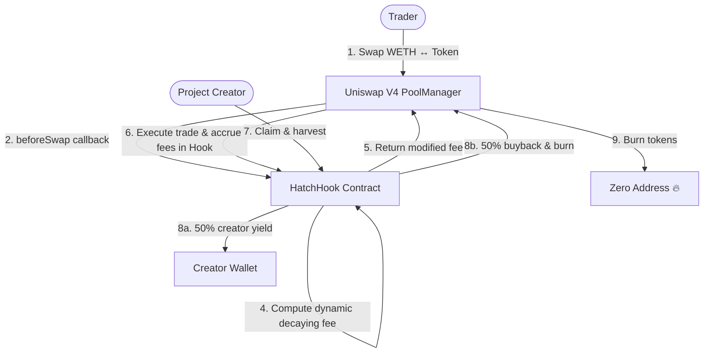

<p align="center">
  
</p>

<h1 align="center">HatchAI</h1>

<p align="center">
  <strong>Uniswap V4 Hook-Protected Token Launchpad on X Layer</strong>
</p>

<p align="center">
  <a href="https://www.oklink.com/xlayer/address/0xb2DaAC3Fc51E958f89A6346f92eF7542805150c0"></a>
  
  
  
  
</p>

---

## Table of Contents

- [Overview](#overview)
- [Problem Statement](#problem-statement)
- [How HatchAI Works](#how-hatchai-works)
- [Architecture](#architecture)
- [Smart Contracts](#smart-contracts)
- [Deployed Addresses](#deployed-addresses)
- [Tech Stack](#tech-stack)
- [Getting Started](#getting-started)
- [Deployment](#deployment)
- [Testing](#testing)
- [Usage Guide](#usage-guide)
- [Project Structure](#project-structure)
- [Contributing](#contributing)
- [License](#license)

---

## Overview

HatchAI is a decentralized token launchpad built on **X Layer** (OKX's EVM L2), powered by **Uniswap V4 Hooks**. It provides institutional-grade launch protection through on-chain dynamic fee decay, anti-whale swap caps, and wallet cooldown timers — all enforced natively inside the Uniswap V4 pool, with zero off-chain dependencies.

Projects can launch tokens directly into protected Uniswap V4 pools where bot frontrunning is financially disincentivized, whale manipulation is capped, and creator yield is automatically generated through a deflationary buyback-and-burn loop.

---

## Problem Statement

Modern token launches on decentralized exchanges suffer from three critical vulnerabilities:

| Threat | Description | Impact |
|--------|------------|--------|
| **Sniper Bots** | Algorithms that buy massive supply in the exact block liquidity is added, frontrunning retail participants | Unfair distribution; community priced out |
| **Whale Manipulation** | Large early swaps that create extreme price slippage and trigger panic selling | Price instability; eroded trust |
| **Unsustainable Yield** | Trading fees go entirely to passive LPs, providing no funding for ongoing project development | Projects lose momentum post-launch |

Existing launchpad models (bonding curves, fair launches) protect the pre-DEX phase but offer **zero protection once liquidity migrates to a public pool**. HatchAI fills this gap.

---

## How HatchAI Works

HatchAI introduces the **`HatchHook`** — a Uniswap V4 hook contract that intercepts swap operations to enforce a configurable launch protection window.

### 🛡️ Dynamic Fee Decay

Swap fees start high (e.g., **10%**) at launch, making bot frontrunning financially non-viable. Over a configurable decay duration (e.g., 24 hours), the fee decays **linearly on-chain** to the project's baseline rate (e.g., **0.3%**).

```
Launch          12h (~5.2%)         24h (0.3%)
  ●━━━━━━━━━━━━━━━●━━━━━━━━━━━━━━━━●
 10% fee         decaying...       standard fee
```

### 🐋 Anti-Whale Swap Caps

Individual transaction sizes are capped during the launch phase, enforcing a maximum swap amount per trade. This ensures decentralized and fair token distribution among early participants.

### ⏱️ Wallet Cooldown Timers

A configurable delay (in seconds) is enforced between consecutive trades from the same wallet address, neutralizing high-frequency trading algorithms.

### 🔥 Deflationary Yield Loop

Collected trading fees (in WETH) are harvested and split on-chain:

- **50% → Creator Yield**: Sent directly to the project creator wallet
- **50% → Buyback & Burn**: Used to buy project tokens from the pool and burn them, applying constant buy pressure and reducing circulating supply

---

## Architecture



### Contract Interaction Flow

```
┌─────────────────────────────────────────────────────────────┐
│                     User's Wallet                           │
│  MetaMask / OKX Wallet                                      │
└──────────────────┬──────────────────────────────────────────┘
                   │ swap(poolKey, params, hookData)
                   ▼
┌─────────────────────────────────────────────────────────────┐
│              Uniswap V4 PoolManager                         │
│  0x360e68faCcca8cA495c1B759Fd9EEe466db9FB32                │
│                                                             │
│  ┌─────────────┐  ┌──────────────┐  ┌──────────────────┐  │
│  │ initialize() │  │ beforeSwap() │  │ afterInitialize()│  │
│  └──────┬──────┘  └──────┬───────┘  └────────┬─────────┘  │
└─────────┼────────────────┼───────────────────┼─────────────┘
          │                │                   │
          ▼                ▼                   ▼
┌─────────────────────────────────────────────────────────────┐
│                 HatchHook Contract                          │
│  Permission Mask: 0x10C0 (afterInitialize|beforeSwap|       │
│                           afterSwap)                        │
│                                                             │
│  ┌──────────────────┐  ┌────────────────────────────────┐  │
│  │  LaunchConfig     │  │  Fee Decay Engine              │  │
│  │  - creator        │  │  - startFee → endFee           │  │
│  │  - projectToken   │  │  - linear decay over duration  │  │
│  │  - decayDuration  │  │  - per-wallet cooldown         │  │
│  │  - maxSwapAmount  │  │  - anti-whale cap enforcement  │  │
│  └──────────────────┘  └────────────────────────────────┘  │
└─────────────────────────────────────────────────────────────┘
```

---

## Smart Contracts

| Contract | Description | Source |
|----------|-------------|--------|
| `HatchHook.sol` | Core hook implementing dynamic fees, anti-whale caps, cooldowns, and yield harvesting | [`contracts/HatchHook.sol`](contracts/HatchHook.sol) |
| `BaseHook.sol` | Abstract base providing Uniswap V4 hook callback scaffolding and `onlyPoolManager` guard | [`contracts/BaseHook.sol`](contracts/BaseHook.sol) |
| `UniswapV4Types.sol` | Type definitions for `PoolKey`, `IHooks`, `IPoolManager`, and helper libraries | [`contracts/UniswapV4Types.sol`](contracts/UniswapV4Types.sol) |
| `MockPoolManager.sol` | Testnet-only mock that simulates the Uniswap V4 PoolManager for local development | [`contracts/mocks/MockPoolManager.sol`](contracts/mocks/MockPoolManager.sol) |
| `MockERC20.sol` | Mintable ERC20 for testnet pool seeding | [`contracts/MockERC20.sol`](contracts/MockERC20.sol) |

### Hook Permissions

HatchHook requires the following Uniswap V4 hook permission flags encoded in the contract's deploy address (lower 14 bits = `0x10C0`):

| Permission | Bit | Used For |
|------------|-----|----------|
| `afterInitialize` | 12 | Register pool with the hook on creation |
| `beforeSwap` | 7 | Enforce anti-whale caps, cooldowns, compute dynamic fee |
| `afterSwap` | 6 | Accrue and track collected fees |

---

## Deployed Addresses

### X Layer Mainnet (Chain ID: `196`)

| Contract | Address | Explorer |
|----------|---------|----------|
| **PoolManager** (Official Uniswap V4) | `0x360e68faCcca8cA495c1B759Fd9EEe466db9FB32` | [View →](https://www.oklink.com/xlayer/address/0x360e68faCcca8cA495c1B759Fd9EEe466db9FB32) |
| **HatchHook** | `0xb2DaAC3Fc51E958f89A6346f92eF7542805150c0` | [View →](https://www.oklink.com/xlayer/address/0xb2DaAC3Fc51E958f89A6346f92eF7542805150c0) |
| **StateView** | `0x76fd297e2d437cd7f76d50f01afe6160f86e9990` | [View →](https://www.oklink.com/xlayer/address/0x76fd297e2d437cd7f76d50f01afe6160f86e9990) |
| **PositionManager** | `0xcf1eafc6928dc385a342e7c6491d371d2871458b` | [View →](https://www.oklink.com/xlayer/address/0xcf1eafc6928dc385a342e7c6491d371d2871458b) |
| **WETH** | `0x5A77f1443D16ee5761d310e38b62f77f726bC71c` | [View →](https://www.oklink.com/xlayer/address/0x5A77f1443D16ee5761d310e38b62f77f726bC71c) |

### X Layer Testnet (Chain ID: `1952`)

| Contract | Address | Explorer |
|----------|---------|----------|
| **PoolManager** (Mock) | `0xe5392F2AF7f2DA3C386cB879C35ABfa2DAcdaE4D` | [View →](https://www.oklink.com/xlayer-test/address/0xe5392F2AF7f2DA3C386cB879C35ABfa2DAcdaE4D) |
| **HatchHook** | `0xe78117Bf2Ca342ce1DcBa2367d3CCAb30bb3508f` | [View →](https://www.oklink.com/xlayer-test/address/0xe78117Bf2Ca342ce1DcBa2367d3CCAb30bb3508f) |
| **WETH** (Mock) | `0xc147621C235a8004adC2C5dFC90b78ef50B0a061` | [View →](https://www.oklink.com/xlayer-test/address/0xc147621C235a8004adC2C5dFC90b78ef50B0a061) |
| **HATCH Token** (Mock) | `0x9363Ef64d538BEe4706Aa2Dd13cfB559441d7c71` | [View →](https://www.oklink.com/xlayer-test/address/0x9363Ef64d538BEe4706Aa2Dd13cfB559441d7c71) |

---

## Tech Stack

| Layer | Technology |
|-------|-----------|
| **Smart Contracts** | Solidity 0.8.24, Hardhat, Ethers.js v6 |
| **Hook Framework** | Uniswap V4 Core (IHooks, IPoolManager) |
| **Deployment** | CREATE2 deterministic deploy (for hook address mining) |
| **Frontend** | React 19, Vite 8, Ethers.js v6 |
| **Wallet Integration** | MetaMask, OKX Wallet (direct `BrowserProvider`) |
| **Chain** | X Layer Mainnet (196) / Testnet (1952) |
| **Block Explorer** | OKLink |
| **Design System** | Sand `#F0ECE4`, Coral `#D2825A`, Ink `#32343A` |
| **Typography** | Work Sans · Instrument Serif (Italic) · Geist Mono |

---

## Getting Started

### Prerequisites

- **Node.js** ≥ 18.x
- **npm** ≥ 9.x
- **MetaMask** or **OKX Wallet** browser extension
- OKB for gas (X Layer Mainnet) or test OKB (Testnet)

### 1. Clone & Install

```bash
git clone https://github.com/your-username/HatchAI.git
cd HatchAI
npm install
```

### 2. Configure Environment

Create a `.env` file in the project root:

```env
PRIVATE_KEY=your_deployer_private_key
XLAYER_TESTNET_RPC=https://testrpc.xlayer.tech
XLAYER_MAINNET_RPC=https://rpc.xlayer.tech
```

### 3. Compile Contracts

```bash
npx hardhat compile
```

### 4. Launch Frontend

```bash
cd frontend
npm install
npm run dev
```

Open [http://localhost:5173](http://localhost:5173) in your browser.

---

## Deployment

### Testnet (X Layer Testnet)

Deploys MockPoolManager, HatchHook, and mock tokens:

```bash
npx hardhat run scripts/deploy.js --network xlayer_testnet
```

### Mainnet (X Layer Mainnet)

Deploys HatchHook via CREATE2 against the official Uniswap V4 PoolManager. The script mines a salt to produce an address whose lower 14 bits match the hook permission mask `0x10C0`:

```bash
npx hardhat run scripts/deploy_mainnet.js --network xlayer_mainnet
```

> **Note:** The mainnet deployment script automatically updates `frontend/src/deployments.json` with the new contract addresses.

---

## Testing

### Fork-Based E2E Test

Runs a full lifecycle simulation against a forked mainnet state — deploys HatchHook via CREATE2, initializes a pool on the official PoolManager, and configures launch parameters:

```bash
npx hardhat test test/SimulateInitialize.js
```

### Local Simulation

Deploys all contracts to a local Hardhat node and simulates the complete swap + fee decay lifecycle:

```bash
npx hardhat run scripts/simulate.js
```

---

## Usage Guide

### 1. Launch a Token Pool

1. Open the app and connect your wallet to **X Layer**
2. Navigate to the **Hatch Pool Portal**
3. Click **+ Create Your Token Sale**
4. Enter your ERC20 token contract address
5. Configure launch parameters:
   - **Decay Duration** — How long the fee decay lasts (e.g., 24 hours)
   - **Start Fee** — Initial high fee to deter bots (e.g., 10%)
   - **End Fee** — Baseline fee after decay completes (e.g., 0.3%)
   - **Anti-Whale Cap** — Max tokens per swap during launch phase
   - **Cooldown** — Seconds between swaps per wallet
6. Click **Initialize Launch Pool** to deploy on-chain

### 2. Trade on a Protected Pool

1. Select a live pool from the **Pool Portal**
2. Click **Enter Swap Terminal**
3. Input the WETH amount and execute the swap
4. The dynamic fee is applied automatically based on time elapsed since launch

### 3. Claim Creator Yield

1. Navigate to the pool dashboard
2. Click **Claim Creator Yield & Trigger Buyback-Burn**
3. 50% of accumulated WETH fees are sent to your wallet
4. The remaining 50% buys back project tokens and burns them

---

## Project Structure

```
HatchAI/
├── contracts/                    # Solidity smart contracts
│   ├── HatchHook.sol            # Core hook: fees, caps, cooldowns, yield
│   ├── BaseHook.sol             # Abstract hook base with permission system
│   ├── UniswapV4Types.sol       # Uniswap V4 interfaces and types
│   ├── MockERC20.sol            # Mintable test token
│   └── mocks/
│       └── MockPoolManager.sol  # Testnet-only pool manager mock
│
├── scripts/                      # Deployment and utility scripts
│   ├── deploy.js                # Testnet full deployment
│   ├── deploy_mainnet.js        # Mainnet CREATE2 deployment
│   ├── simulate.js              # Local lifecycle simulation
│   └── simulate_fork.js         # Mainnet fork simulation
│
├── test/
│   └── SimulateInitialize.js    # E2E fork-based integration test
│
├── frontend/                     # React SPA
│   ├── src/
│   │   ├── App.jsx              # Main application UI
│   │   ├── WalletContext.jsx    # On-chain state management & wallet provider
│   │   ├── deployments.json     # Auto-updated contract addresses
│   │   ├── index.css            # Design system & theme tokens
│   │   └── lib/                 # Wallet connection & chain utilities
│   └── package.json
│
├── hardhat.config.js             # Hardhat configuration (Solidity 0.8.24, viaIR)
├── package.json
└── README.md
```

---

## Contributing

Contributions are welcome. Please follow these steps:

1. Fork the repository
2. Create a feature branch (`git checkout -b feature/my-feature`)
3. Commit your changes (`git commit -m 'Add my feature'`)
4. Push to the branch (`git push origin feature/my-feature`)
5. Open a Pull Request

Please ensure all contracts compile and tests pass before submitting.

---

## License

This project is licensed under the [ISC License](LICENSE).

---

<p align="center">
  Built on <strong>X Layer</strong> · Powered by <strong>Uniswap V4 Hooks</strong>
</p>
